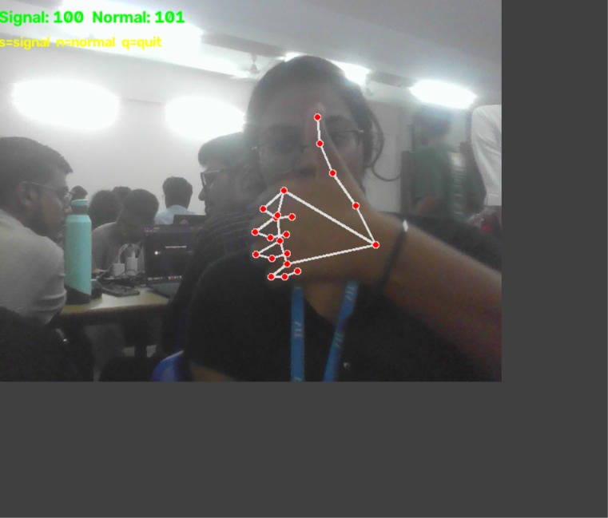
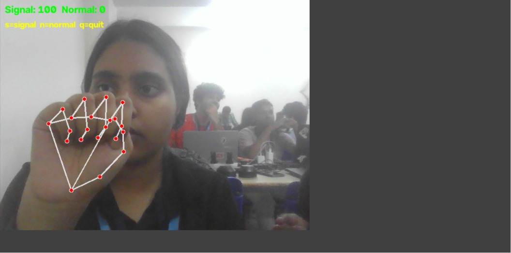

<div align="center">

# 🧥 CLOAK

### A safety app that's already open before anything happens.

*Passive silent-distress detection, hidden behind an ordinary screen.*

</div>

---

## Project Summary

CLOAK is a browser-based safety application that passively watches for the internationally recognized **"Signal for Help"** hand gesture through a webcam — no button press, no spoken trigger, no visible action required. It runs disguised behind an ordinary-looking decoy interface, so detection is invisible to anyone watching the screen. On confirmed detection, it silently logs and (in this prototype) simulates an alert to the user's pre-selected trusted contacts.

Built in a 12-hour hackathon under the **Safety / Public Safety** track.

---

## Personal Motivation

We're two second-year engineering students, one from an AI/ML background, one from a core branch and this hackathon was our first real attempt at taking machine learning out of the classroom and into a problem that actually matters. We'd both learned the theory behind models like this, but never built and trained one from scratch, on our own data, for a use case with real stakes. Choosing a safety-focused project pushed us to think past accuracy metrics and actually consider who would use this, when, and why existing tools fail them — a shift in thinking we think is more valuable to us long-term than the hackathon result itself.

---

## Problem Statement

Existing personal-safety apps like bSafe, Life360, generic SOS apps, all require the user to press a button, speak a trigger phrase, or actively open the app. All three fail in the exact scenario they are designed for: the victim is being watched, cannot reach their phone discreetly, and cannot make a sound without escalating danger.

**Target user:** someone in a room, video call, or public space who cannot safely speak or visibly use their phone, but can subtly show their hand to a camera.

---

## Real World Incident

In August 2025, a domestic violence victim at a convenience store in Alhambra, California was accompanied by her alleged abuser and unable to speak freely about her situation, so she asked for help using hand signals behind her back, which store staff and police later confirmed was a deliberate call for assistance without alerting her abuser. The Alhambra Police Department credited the recognized "Signal for Help" gesture with allowing the incident to be identified and addressed safely. This is exactly the scenario CLOAK is built for: a victim in the physical presence of their abuser, unable to speak or reach for a phone, relying on a small, deliberately inconspicuous gesture to get help. CLOAK asks a simple question ,if one observant bystander recognizing this signal can save a life, what happens when a camera is trained to recognize it automatically, every time, without needing a bystander to be paying attention at exactly the right moment?

---

## Why Current Solutions Fail

| Existing Approach | Failure Point |
|---|---|
| SOS button apps (bSafe, etc.) | Requires visibly reaching for and unlocking a phone |
| Voice-trigger apps | Requires speaking : impossible if the threat is present and listening |
| Location-sharing apps (Life360) | Passive tracking only, no active distress signal |
| Wearable panic buttons | Requires a separate device, plus a deliberate physical action that can be seen |

The common thread: **every existing tool requires an action the victim often cannot safely take.**

---

## Our Solution

CLOAK flips the model. Instead of requiring the victim to *do* something in the moment, it is already running — quietly watching for one specific, deliberately subtle gesture — before anything happens. The gesture is:

1. Recognized worldwide (created by the Canadian Women's Foundation)
2. Physically small and easy to disguise as an idle hand movement
3. Detectable without sound or visible phone use

CLOAK combines a pretrained hand-landmark model with a custom-trained classifier to detect this gesture in real time, hidden behind a convincing decoy screen.

---

## Architecture Diagram

```
┌─────────────────────────────────────────────┐
│              Webcam Input (Live)            │
└───────────────────────┬─────────────────────┘
                        ▼
┌───────────────────────────────────────────────┐
│   Layer 1 — Decoy UI (visible by default)     │
│   Weather Widget — disguise                   │
└───────────────────────┬───────────────────────┘
                        ▼  (runs invisibly behind Layer 1)
┌─────────────────────────────────────────────┐
│  Layer 2 — Detection Engine Core Innovation │
│  MediaPipe Hands → 21 landmarks             │
│  RandomForestClassifier → signal /not-signal│
│  Hold-time check (~1.5s) → trigger event    │
└───────────────────────┬─────────────────────┘
                        ▼
┌─────────────────────────────────────────────┐
│  Layer 3 — Alert Log / Dashboard (hidden)   │
│  Contact name, timestamp, location          │
│  Demo-mode toggle for judges                │
└─────────────────────────────────────────────┘
```
---

## Layer 1 — Decoy Interface

A weather app — deliberately ordinary, plausible on any laptop screen, and unlikely to draw a second glance. This is what's on screen at all times by default; the entire detection pipeline runs invisibly behind it, so an observer sees nothing but a normal weather widget.

---

## Layer 2 — Detection Engine- Core Innovation

The genuine two-stage ML pipeline, and the heart of the project:

**Stage 1 — Pretrained model:** MediaPipe Hands (Google) extracts 21 `(x, y, z)` landmark coordinates per detected hand, per frame. A real, already-trained neural network — not built by the team, only called.

**Stage 2 — Custom-trained classifier:** A `RandomForestClassifier` (scikit-learn), trained by the team on ~300–400 self-collected labeled samples, takes those 63 numbers (21 points × x/y/z) and classifies each frame as **signal (1)** or **not-signal (0)**.

**Hold-time confirmation:** the signal must be detected continuously for ~1.5 seconds before triggering — this eliminates false positives from a single stray frame.

> *"We use a pretrained model, MediaPipe Hands, to extract hand geometry from every frame  that's real, off-the-shelf deep learning. On top of that, we trained our own classifier on data we collected ourselves to recognize this specific signal. It's a genuine two-stage ML pipeline: transfer learning at the feature-extraction layer, custom supervised learning at the decision layer."*

---

## Layer 3 — Alert Log & Dashboard

On confirmed trigger, an alert is logged with contact name, timestamp, and location (simulated send in this prototype — see [Notes](#notes)). In real deployment this dashboard stays permanently hidden; a **demo-mode toggle** lets judges switch to a visible view to watch detection happen live, without changing how the product would actually run for a real user.

---

## Why It Works

- **No action required from the victim** — the gesture is the only thing needed, and it's designed to look incidental.
- **Hold-time filtering** removes single-frame false positives, so a stray hand movement near the face doesn't trigger a false alert.
- **Routes to trusted contacts, not police** — a false positive becomes a low-stakes check-in text, not a wasted emergency dispatch (see [Comparison Table](#comparison-table) and reasoning below).
- **Fully local processing** — nothing is uploaded or recorded, addressing the obvious "camera always on" privacy concern before it's even raised.

---

## Screenshots

> *[Add screenshots here once the decoy UI and dashboard are built — e.g. decoy screen, live detection with landmark overlay, alert log firing, and the "normal wave does NOT trigger" proof. Use `` format once images are in your `assets/` folder.]*

---

## Comparison Table

| Feature | bSafe / SOS Apps | Life360 | **CLOAK** |
|---|---|---|---|
| Requires pressing a button |  Yes |  N/A |  **No** |
| Requires speaking | Sometimes |  No |  **No** |
| Works when phone is inaccessible |  No |  No |  **Yes** |
| Passive / always-on detection |  No | Partial (location only) |  **Yes** |
| Disguised interface |  No |  No | **Yes** |
| Local-only processing | Varies |  No (cloud-based) |  **Yes** |
| Routes to trusted contact first | Varies |  Yes |  **Yes** |

---

## Underlying Technology Explained

- **MediaPipe Hands** — a Google-built, pretrained deep learning model that detects 21 anatomical landmarks (knuckles, fingertips, palm, wrist) per hand, per video frame. Free, offline-capable, and genuinely pretrained — this is CLOAK's "real AI" credibility anchor.
- **RandomForestClassifier (scikit-learn)** — an ensemble of decision trees. Given the 63 numbers describing hand geometry, it learns to separate "signal" from "normal movement" from labeled training data. Fast to train, robust on small clean datasets, and highly interpretable.
- **Hold-time logic** — a simple temporal filter requiring consistent classification across multiple consecutive frames (~1.5 seconds) before firing, rather than acting on any single frame.
- **Streamlit** — turns the Python detection pipeline into a live, deployable web dashboard with minimal frontend code.

---

## Technology ↔ Project Mapping Table

| Technology | Role in CLOAK | Why This One |
|---|---|---|
| Python | Core language | Fast iteration, huge ML ecosystem |
| OpenCV (`cv2`) | Captures webcam frames | Standard, offline, well-documented |
| MediaPipe Hands | Extracts 21 hand landmarks/frame | Free, offline, genuine pretrained model |
| scikit-learn (RandomForest) | Classifies signal vs. not-signal | Beginner-friendly, fast, interpretable |
| Streamlit | Turns script into web app/dashboard | Minimal code for a real-looking UI |
| streamlit-webrtc | Enables webcam on deployed version | Needed for continuous live video, not just snapshots |
| GitHub + Streamlit Community Cloud | Version control + live deployment | Auto-redeploys on every push |

---

## Demo Walkthrough

1. Open on the decoy screen (weather app), nothing unusual visible.
2. Switch to demo mode: dashboard shows live camera feed, status = "monitoring."
3. Flash the Signal for Help gesture — hold for ~1.5s.
4. Alert fires: status flips, simulated alert log entry appears with contact, timestamp, location.
5. Show a normal hand wave immediately after — **no trigger fires**, proving this isn't a hair-trigger gimmick.

> *[Once recorded, add a link or embedded GIF/video of an actual demo run here.]*

---

## Notes

- All alert sending is **simulated** in this prototype — no real SMS/call integration was built, to avoid dependency on unreliable venue wifi during judging.
- Alerts are designed to route to the user's own pre-selected **trusted contacts**, not police directly — this mirrors how the real Signal for Help gesture was designed to work, and avoids the false-positive/liability issues of auto-dispatching emergency services from an AI trigger.
- Model was tested only across team members during this build; broader testing across skin tones/lighting conditions is a planned next step, not yet validated.

---

## Tech Stack

| Component | Purpose |
|---|---|
| Python | Core language |
| OpenCV | Webcam capture |
| MediaPipe Hands | Pretrained hand landmark detection |
| scikit-learn | Custom-trained RandomForestClassifier |
| Streamlit | Web dashboard framework |
| streamlit-webrtc | Live webcam access on deployed app |
| GitHub + Streamlit Community Cloud | Version control + deployment |

---

## Installation

```bash
git clone https://github.com/anweshabuilds25/cloak.git
cd cloak
pip install -r requirements.txt
streamlit run app.py
```

**Live deployed version:** *

---
Nope! You do NOT have to rename them. Renaming is just for neatness.

If you're okay with filenames like:

login.jpg
emergency.png
image.png

that's completely fine.

The only rule is:

The filename in the README must exactly match the filename in the assets folder.

For example, if your folder is:

assets/
├── login.jpg
├── image.png
├── emergency.png

then your README should use:

## Screenshots
### Login Screen


### Dashboard


### Emergency Mode



## References

- [Signal for Help — Canadian Women's Foundation](https://canadianwomen.org/signal-for-help/)
- [MediaPipe Hands — Google AI Edge](https://ai.google.dev/edge/mediapipe/solutions/vision/hand_landmarker)
- [scikit-learn RandomForestClassifier documentation](https://scikit-learn.org/stable/modules/generated/sklearn.ensemble.RandomForestClassifier.html)
- [Streamlit documentation](https://docs.streamlit.io/)
